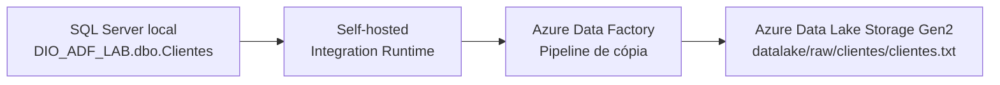
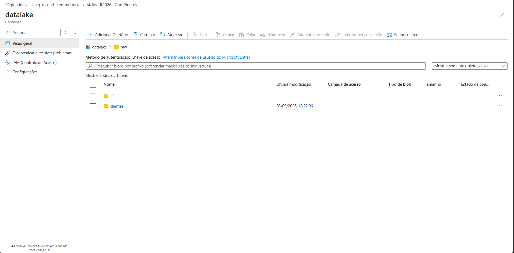
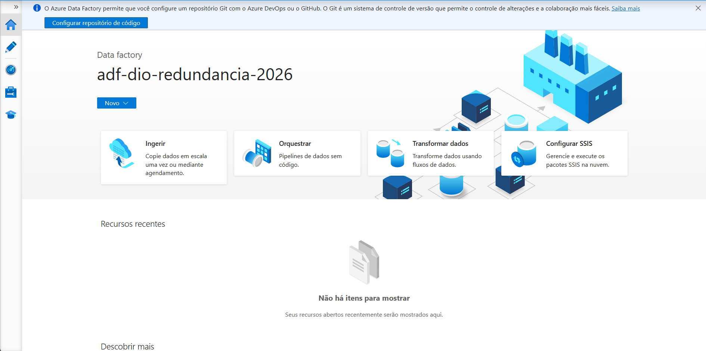
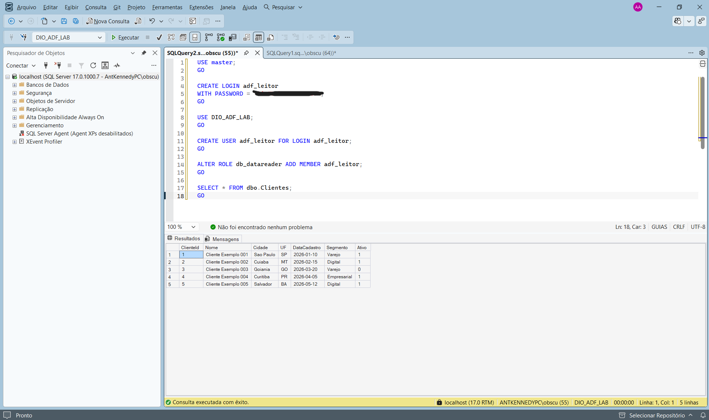
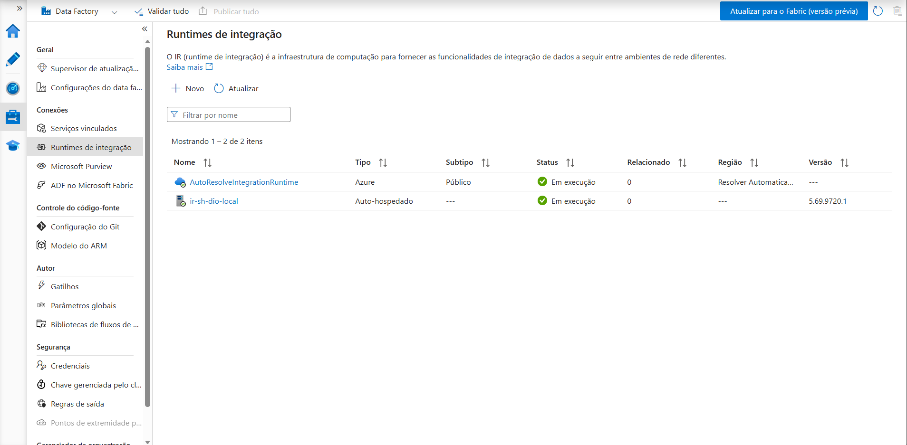
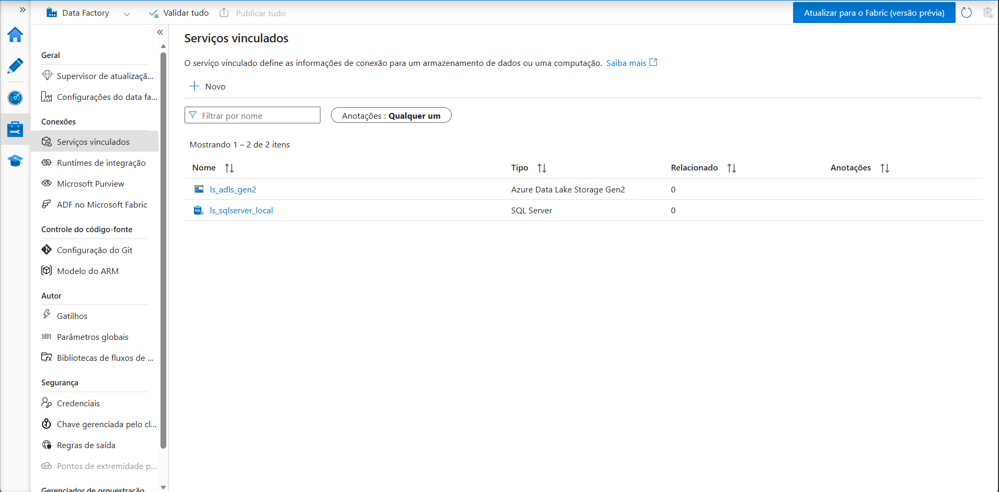
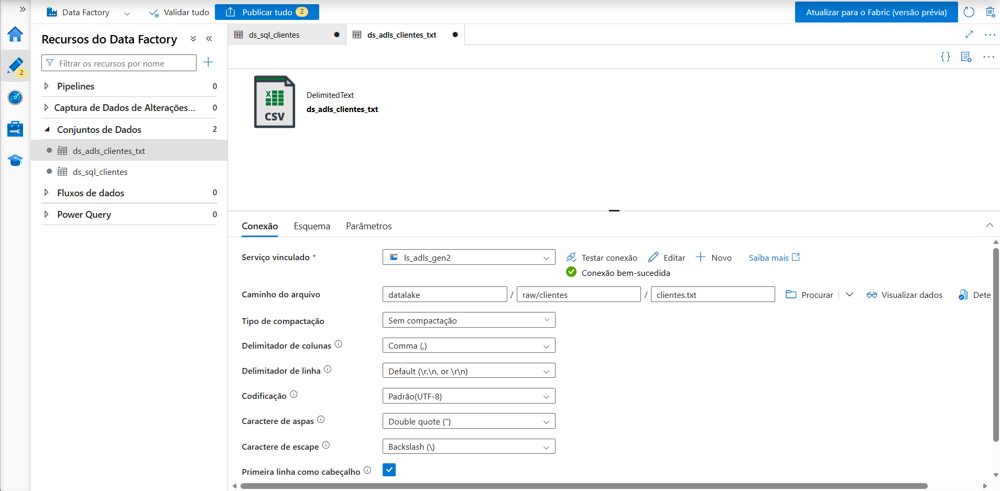
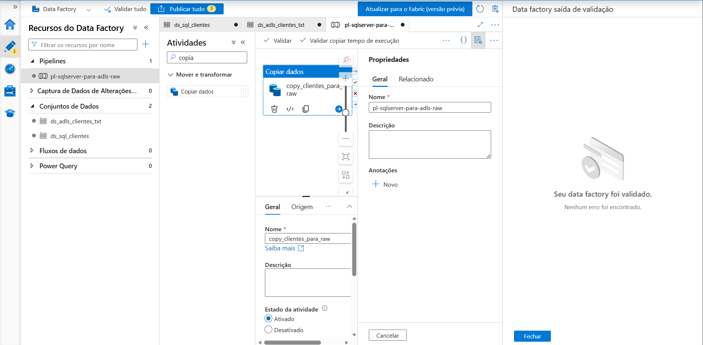
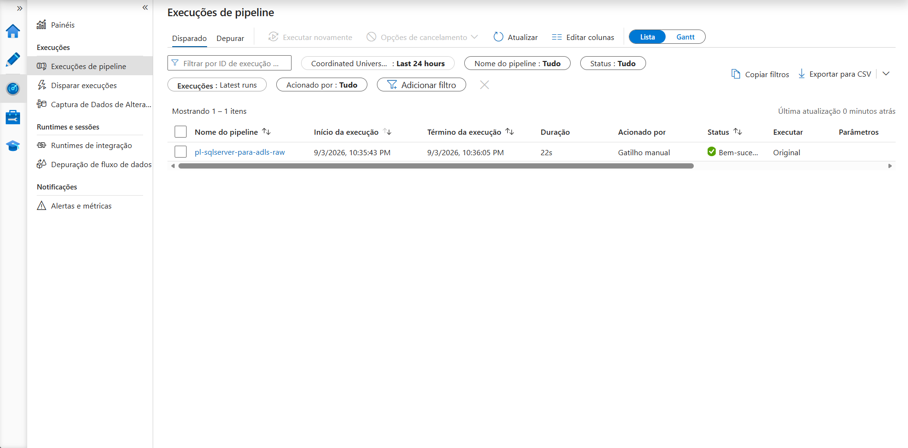
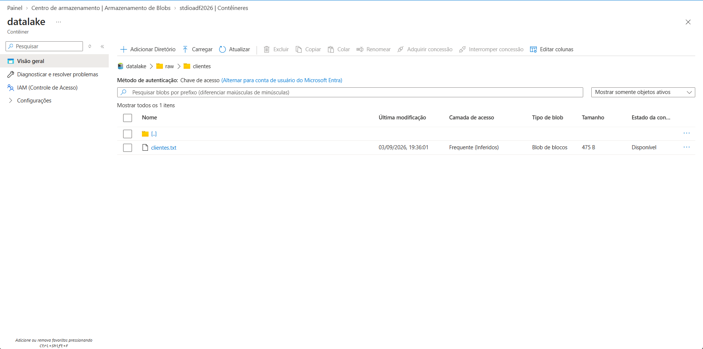

# Redundância de Arquivos com Azure Data Factory

Projeto prático desenvolvido para demonstrar a criação de uma pipeline híbrida no Azure Data Factory, responsável por copiar dados de um SQL Server local para o Azure Data Lake Storage Gen2 em formato `.txt`.

## Objetivo

Implementar um processo de redundância de arquivos em nuvem, movendo dados fictícios da tabela `dbo.Clientes`, hospedada em um SQL Server local, para a camada `raw` do Azure Data Lake Storage Gen2.

## Arquitetura



## Tecnologias utilizadas

- Microsoft Azure
- Azure Data Factory
- Self-hosted Integration Runtime
- Azure Data Lake Storage Gen2
- SQL Server Express
- SQL Server Management Studio
- GitHub

## Estrutura implementada

```text
SQL Server local
└── DIO_ADF_LAB
    └── dbo.Clientes

Azure Data Lake Storage Gen2
└── datalake
    └── raw
        └── clientes
            └── clientes.txt
```

## Processo realizado

1. Criação de um Resource Group no Azure.
2. Criação de uma Storage Account com Namespace Hierárquico habilitado, tornando-a compatível com ADLS Gen2.
3. Criação do container `datalake` e da camada `raw/clientes`.
4. Criação do Azure Data Factory.
5. Instalação e registro do Self-hosted Integration Runtime na máquina local.
6. Criação de um SQL Server local com a base `DIO_ADF_LAB` e a tabela fictícia `dbo.Clientes`.
7. Criação dos Linked Services para SQL Server local e Azure Data Lake Storage Gen2.
8. Criação dos datasets de origem e destino.
9. Criação da pipeline `pl-sqlserver-para-adls-raw`.
10. Execução e monitoramento da cópia dos dados para o arquivo `clientes.txt`.

## Evidências

### Data Lake Storage Gen2



### Azure Data Factory



### Base SQL Server com dados fictícios



### Self-hosted Integration Runtime



### Linked Services configurados



### Dataset de destino no Data Lake



### Pipeline validada



### Execução bem-sucedida



### Arquivo TXT gerado no Data Lake



## Resultado

A pipeline foi executada com sucesso e transferiu os cinco registros fictícios da tabela `dbo.Clientes` para o arquivo:

```text
datalake/raw/clientes/clientes.txt
```

O arquivo foi gerado em formato TXT delimitado por vírgulas, codificado em UTF-8 e contendo cabeçalho.

## Insights adquiridos

- O Azure Data Factory permite orquestrar processos de movimentação de dados entre ambientes locais e a nuvem.
- O Self-hosted Integration Runtime é o componente que permite acessar fontes on-premises sem expor diretamente o banco de dados à internet.
- Linked Services representam conexões; datasets representam os dados de origem e destino; pipelines definem a lógica de execução.
- A camada `raw` preserva os dados recebidos em seu formato mais próximo possível da origem.
- Mesmo uma carga simples deve ser validada, monitorada e documentada para oferecer rastreabilidade.

## Possíveis evoluções

- Parametrizar o nome e o caminho dos arquivos por data de execução.
- Criar gatilhos agendados para execução automática.
- Armazenar senhas no Azure Key Vault.
- Adotar autenticação por Managed Identity no Storage Account.
- Gravar os dados em Parquet para melhor desempenho analítico.
- Criar camadas `bronze`, `silver` e `gold` para tratamento e disponibilização dos dados.

## Observação sobre custos

A pipeline foi executada manualmente, sem gatilhos recorrentes. Após a avaliação do projeto, os recursos podem ser removidos pelo Resource Group para evitar consumo desnecessário do crédito de avaliação do Azure.

## Autor
Antony Kennedy Ribeiro de Araújo

Projeto desenvolvido como parte do bootcamp Microsoft AI for Tech - Azure Databricks da DIO.
